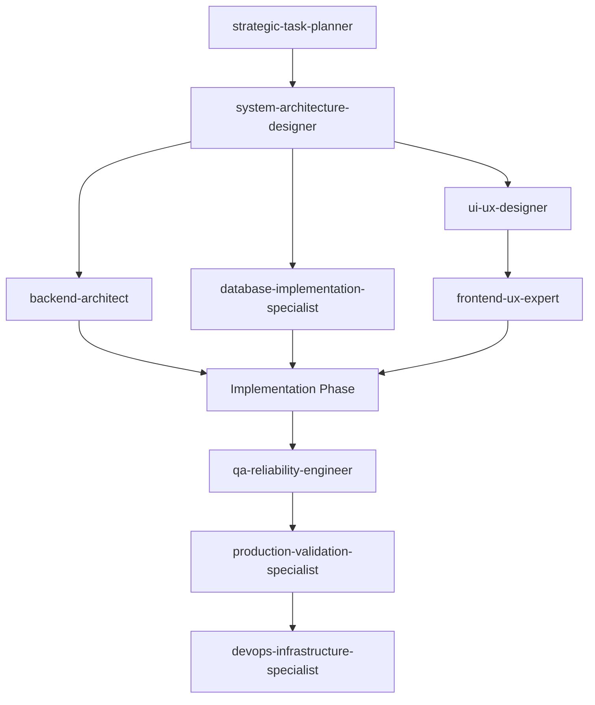
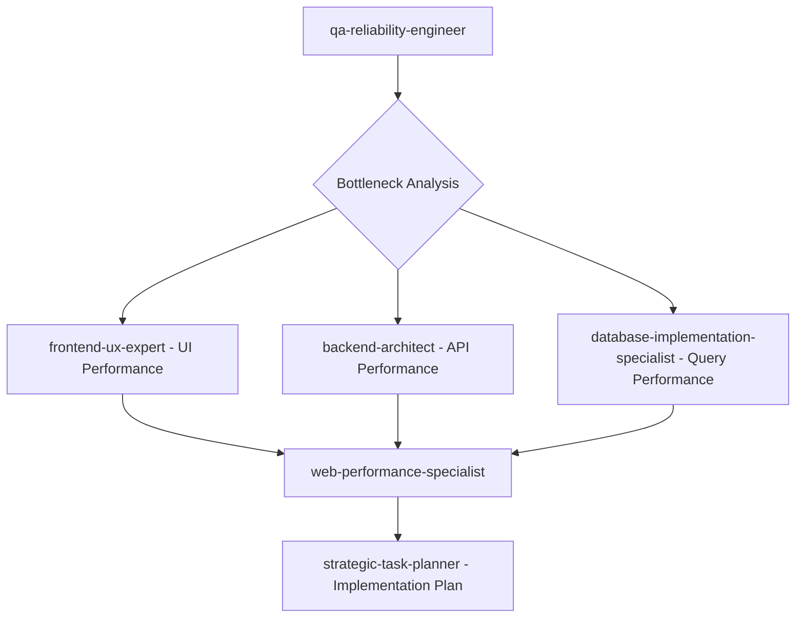
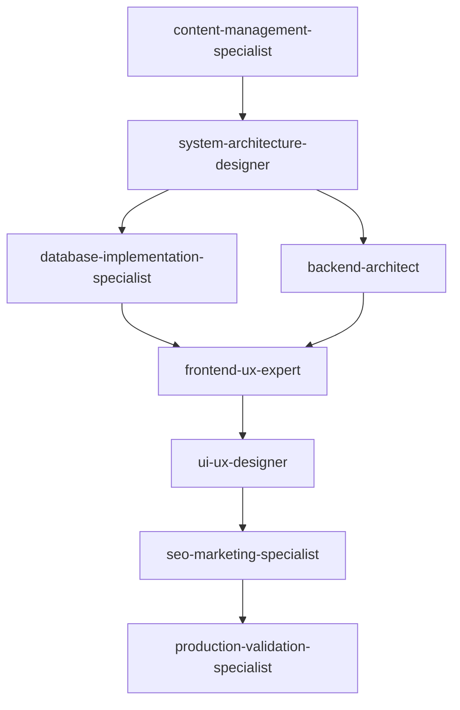

# Agent Integration & Workflow Improvements

## 🔄 **Enhanced Collaboration Patterns**

### **Architecture Review Board Pattern**

```
system-architecture-designer → backend-architect → database-implementation-specialist
```

**Use Case**: Complex system design requiring multiple technical perspectives
**Handoff Points**:

- System design complete → Backend implementation planning
- Backend architecture defined → Database implementation specifics

### **Security-First Development Pattern**

```
web-security-specialist → ALL implementation agents
```

**Use Case**: Any development work requiring security considerations
**Continuous Involvement**: Security specialist reviews all agent outputs before finalization

### **Performance-Driven Development Pattern**

```
web-performance-specialist ↔ frontend-ux-expert ↔ backend-architect ↔ database-implementation-specialist
```

**Use Case**: Performance-critical applications requiring optimization across all layers
**Coordination**: Performance budgets set early, validated at each development phase

### **Quality Assurance Pipeline Pattern**

```
[Implementation Agents] → qa-reliability-engineer → production-validation-specialist → devops-infrastructure-specialist
```

**Use Case**: Production-ready deployments
**Quality Gates**: Testing → Production readiness → Infrastructure deployment

## 🎯 **Specialized Workflow Chains**

### **Full-Stack Feature Development**



### **Performance Optimization Workflow**



### **Content Management System Development**



## 📋 **Enhanced Communication Protocols**

### **Agent Handoff Checklist**

Before transferring work between agents:

**Technical Handoff Requirements:**

- [ ] Current implementation state documented
- [ ] Technical constraints and decisions logged
- [ ] Dependencies clearly identified
- [ ] Success criteria defined
- [ ] Risk assessment completed
- [ ] Timeline expectations set

**Quality Handoff Requirements:**

- [ ] Code review completed (if applicable)
- [ ] Documentation updated
- [ ] Tests passing (if applicable)
- [ ] Performance benchmarks met
- [ ] Security considerations addressed
- [ ] Accessibility requirements validated

### **Cross-Agent Communication Standards**

**Status Indicators:**

- 🟢 **Ready for Handoff** - Work completed, ready for next agent
- 🟡 **Needs Input** - Blocked, waiting for clarification or dependencies
- 🔴 **Critical Issue** - Major blocker requiring immediate attention
- 🔄 **In Collaboration** - Multiple agents working together
- ✅ **Complete** - Task fully finished and validated

**Communication Templates:**

**For Requesting Collaboration:**

```markdown
## COLLABORATION REQUEST

**From:** [requesting-agent]
**To:** [target-agent]
**Priority:** High/Medium/Low
**Context:** [Brief description of the situation]
**Specific Need:** [What expertise is needed]
**Deliverable Expected:** [What should be provided]
**Deadline:** [When needed]
**Dependencies:** [What information/work is required first]
```

**For Technical Decisions:**

```markdown
## TECHNICAL DECISION RECORD

**Decision:** [What was decided]
**Context:** [Why this decision was needed]
**Options Considered:**

- Option 1: [pros/cons]
- Option 2: [pros/cons]
  **Decision Rationale:** [Why this option was chosen]
  **Impact on Other Agents:** [How this affects downstream work]
  **Validation Required:** [How to verify this decision is correct]
```

## 🎭 **Agent Role Clarification Matrix**

### **When Multiple Agents Could Apply**

| Scenario                          | Primary Agent                      | Supporting Agents                                                         | Rationale                                                                                          |
| --------------------------------- | ---------------------------------- | ------------------------------------------------------------------------- | -------------------------------------------------------------------------------------------------- |
| "Slow database queries"           | database-implementation-specialist | qa-reliability-engineer, backend-architect                                | Database expert leads, QA validates performance, Backend provides context                          |
| "User interface is confusing"     | ui-ux-designer                     | frontend-ux-expert                                                        | Designer analyzes UX, Frontend implements changes                                                  |
| "API needs better error handling" | backend-architect                  | qa-reliability-engineer, frontend-ux-expert                               | Backend leads technical implementation, QA validates reliability, Frontend handles user experience |
| "Need deployment pipeline"        | devops-infrastructure-specialist   | strategic-task-planner, production-validation-specialist                  | DevOps leads implementation, Planner organizes rollout, Validation ensures readiness               |
| "Performance optimization needed" | web-performance-specialist         | frontend-ux-expert, backend-architect, database-implementation-specialist | Performance specialist coordinates, others implement domain-specific optimizations                 |

### **Escalation Paths**

**Technical Conflicts:**

1. Agents document competing approaches
2. system-architecture-designer arbitrates high-level decisions
3. strategic-task-planner manages project impact
4. User provides final decision if needed

**Resource Constraints:**

1. strategic-task-planner assesses priorities
2. web-server-pm manages timeline adjustments
3. Agents collaborate on reduced-scope solutions

## 🔧 **Quality Gates Integration**

### **Development Phase Gates**

**Planning Gate:**

- [ ] strategic-task-planner: Requirements decomposed
- [ ] system-architecture-designer: Architecture approved
- [ ] All relevant specialists: Feasibility confirmed

**Design Gate:**

- [ ] ui-ux-designer: User experience validated
- [ ] system-architecture-designer: Technical design complete
- [ ] web-security-specialist: Security model approved
- [ ] web-performance-specialist: Performance budgets set

**Implementation Gate:**

- [ ] All implementation agents: Core functionality complete
- [ ] qa-reliability-engineer: Tests passing
- [ ] documentation-research-specialist: Documentation updated

**Pre-Production Gate:**

- [ ] production-validation-specialist: No mocks/stubs remaining
- [ ] web-security-specialist: Security audit passed
- [ ] web-performance-specialist: Performance targets met
- [ ] qa-reliability-engineer: Load testing completed

**Deployment Gate:**

- [ ] devops-infrastructure-specialist: Infrastructure ready
- [ ] production-validation-specialist: Final validation complete
- [ ] strategic-task-planner: Rollback plan confirmed

## 🚀 **Efficiency Optimizations**

### **Parallel Work Strategies**

**Concurrent Development:**

- Frontend and Backend can work simultaneously with agreed API contracts
- Database design and Backend architecture can proceed in parallel
- Documentation can be updated while implementation is ongoing
- Testing strategies can be designed while features are being built

**Shared Deliverables:**

- API specifications: backend-architect + frontend-ux-expert
- Data models: database-implementation-specialist + backend-architect
- Performance requirements: web-performance-specialist + qa-reliability-engineer
- Security requirements: web-security-specialist + all implementation agents

### **Knowledge Sharing Mechanisms**

**Agent Knowledge Base:**

- Each agent maintains expertise documentation
- Cross-references to related agent capabilities
- Common integration patterns documented
- Lessons learned from previous collaborations

**Regular Sync Points:**

- Weekly architecture reviews
- Daily standups for active projects
- Post-project retrospectives
- Technology trend sharing sessions

## 📊 **Success Metrics**

### **Collaboration Quality Indicators**

- Handoff completion rate without re-work
- Time from request to agent response
- Quality of deliverables at handoff points
- User satisfaction with multi-agent outcomes

### **Process Improvement Tracking**

- Identification of workflow bottlenecks
- Agent utilization optimization
- Reduction in duplicate effort
- Improvement in delivery timelines

---

**Remember**: Effective agent collaboration requires clear communication, well-defined responsibilities, and continuous process improvement. Each agent should focus on their expertise while maintaining awareness of how their work impacts others in the development pipeline.
